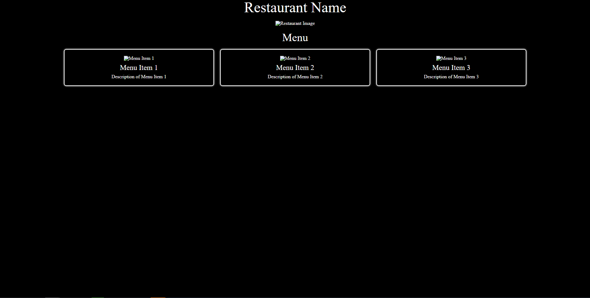

# Project 2 Mitchell Skelton u3236482 Front-End Web Design 11056

## Reflection
Already knowing one of the best AI assistants ChatGPT I didn’t have to do much research into finding out about it. I did some brainstorming on what website I was going to design and landed on designing for a Japanese Restaurant. After this I began by creating the html page I was going to use and setting up all the other CSS and JavaScript files needed for this project. Initially I generated my code through ChatGPT where I gave it some prompts to create the website based off. The prompts are as follows:
1.	Code a website using a dark colour scheme for a Japanese sushi restaurant, include a big hero content with text of the restaurant name and an image. Please also make a card like system where the menu items are displayed on each card, this card system should be displayed in rows of 3 using HTML, CSS and bootstrap.
2.	Please make the background black and have the card border as a glowing white 2px.
3.	Please make it so the cards do not come within 10% of the edge of the screen.

### ChatGPT Initial Generation

After this initial generation from ChatGPT I started to work on the website coding myself. I started to add in a navigation bar above what ChatGPT generated and properly styled the generated code to my liking. I sourced an image for the hero content and applied it to a grid system where the title of the restaurant was on the left and the image was on the right. I then started to work on the menu that ChatGPT generated using bootstrap for me which was pretty helpful. I tweaked ChatGPTs code to get rid of the initial white glowing border as I didn’t like it anymore and instead had the border appear on hover. After finishing with ChatGPTs initial code I started to implement my own additions after having some ideas. I added an about section where the user can read about the restaurant which was generated by ChatGPT.

I added in some pictures of food items that the restaurant could possibly be selling as a banner type display beneath the about section. I initially wanted to code the titles of “Sushi”, “Sashimi”, “Hosomaki” and “Udon” on top of the images but couldn’t manage to properly figure it out as some weird issues would appear (I have done this before with no issues). Instead, I photoshopped the words on and reimported the images back onto the website which was a quick solution (not the preferred method). I applied a hover effect to these 4 images so the user knows that they are clickable. Here bootstrap was rough to get my head around but eventually got the result I wanted with the 4-grid display. Considering this is only a simple experimental website I didn’t create any extra pages for those sections. I also only created this website on a single html file as to keep it 1 page (simple). The navigation bar links are anchored to different parts of the page letting the user quickly skip to their desired section. Lastly, I added in a simple reservation form down the bottom.

The responsiveness of the website worked really well considering I had to use no media queries for the bootstrap parts of the code. It seems a little clunky in parts, but I assume that’s just bootstrap doing its thing. The hero content was kept the same until around 550px where the hero image gets hidden and the Kinoko text in centered providing better readability for the users. The header also changes around 900px to hide the Kinoko in the top left and center the navigation links. I kept the site as a dark theme as most Japanese restaurants feel this way and makes the images pop and stand out more on the website.

Overall, I enjoyed working on this project using bootstrap. It’s a bit awkward to get my head around initially but after some playing around I got the hang of it and was able to create a responsive website using its classes and etc. I much prefer coding raw HTML, CSS and JS but this was a nice change of pace.
